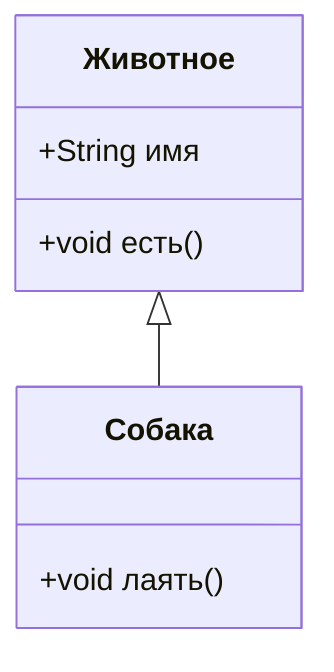
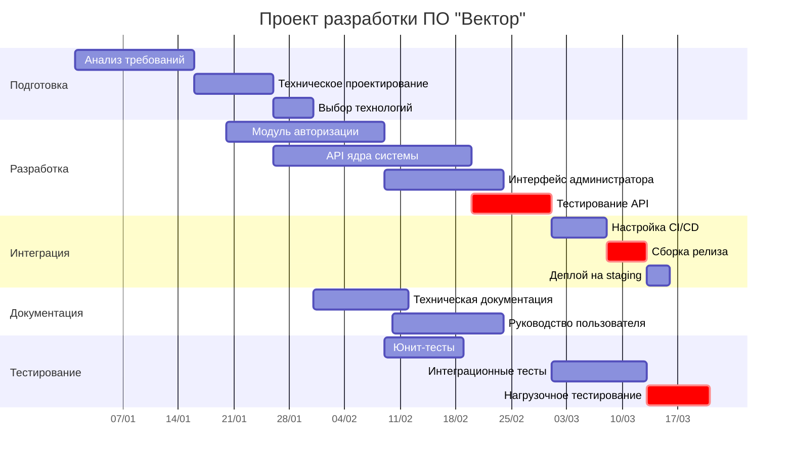
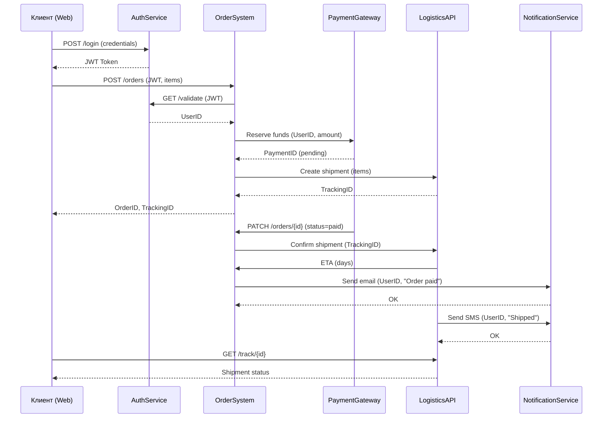

```python
a = float(input("Введите первое число: "))
b = float(input("Введите второе число: "))
operation = input("Выберите операцию (+, -, *, /): ")

if operation == "+":
    print(f"Результат: {a + b}")
elif operation == "-":
    print(f"Результат: {a - b}")
elif operation == "*":
    print(f"Результат: {a * b}")
elif operation == "/":
    if b != 0:
        print(f"Результат: {a / b}")
    else:
        print("Ошибка: деление на ноль!")
else:
    print("Неверная операция!")
```

dj[sjdbladjkbfjsvljahvbdfljavf;hqv;hfe





